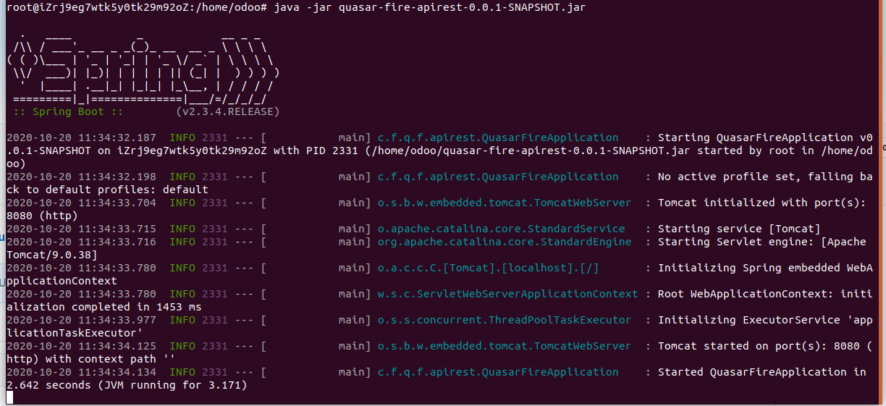
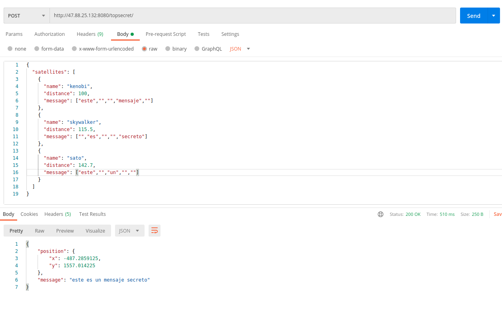

## Instalación
### Requerimientos

- JDK 11+
- Maven  (Para generar el .jar)
- SCREEN

Este manual es para Ubuntu.

### Intalación
En la carpeta del proyecto ejecutar 
~~~
 mvn clean package
~~~
En la ruta **/target** se se encuentra el archivo **quasar-fire-apirest-0.0.1-SNAPSHOT.jar**
copiar el archivo al servidor donde se va a ejecutar.

En el servidor donde se va a publicar ejecutar los siguientes comandos:
~~~
 screen -S quasar
~~~
~~~
java -jar quasar-fire-apirest-0.0.1-SNAPSHOT.jar
~~~

Si el programa corre exitosamente saldra como en la siguiente patalla:

Luego se puede ejecutar Ctrl+a+d

Con lo que va a quedar el programa corriendo.

Imagen de prueba del programa en postman

### Notas
- El sistema se desarrollo con el framework Spring.
- Se realizaron pruebas unitarias y de integración.
